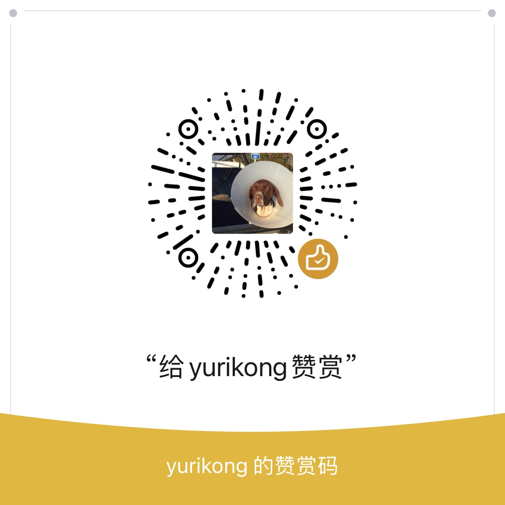

 

<h3 align="center">Jianqiang Du's Portfolio</h3>

<a href="./README.md">EN</a>
| <a href="./README_zh.md">ZH</a>

---

Hi there! Welcome to my portfolio site!

## 📝 Table of Contents

- [About](#about)
- [Authors](#authors)
- [Acknowledgments](#acknowledgement)
- [Support](#support)

## 🧠About 

Welcome to my portfolio site! It's using <a href="https://github.com/yurikong/astro-resume-minimalist/">Astro Resume Minimalist</a> as the site template. I built that as well!

## ✍️ Authors 

- [@Jianqiang Du](https://github.com/yurikong)

## 🉠Acknowledgements 

- [@Brittany Chiang](https://brittanychiang.com)

## 💸 Support 

- Wechat

  

 

- Buy me a coffee

  
