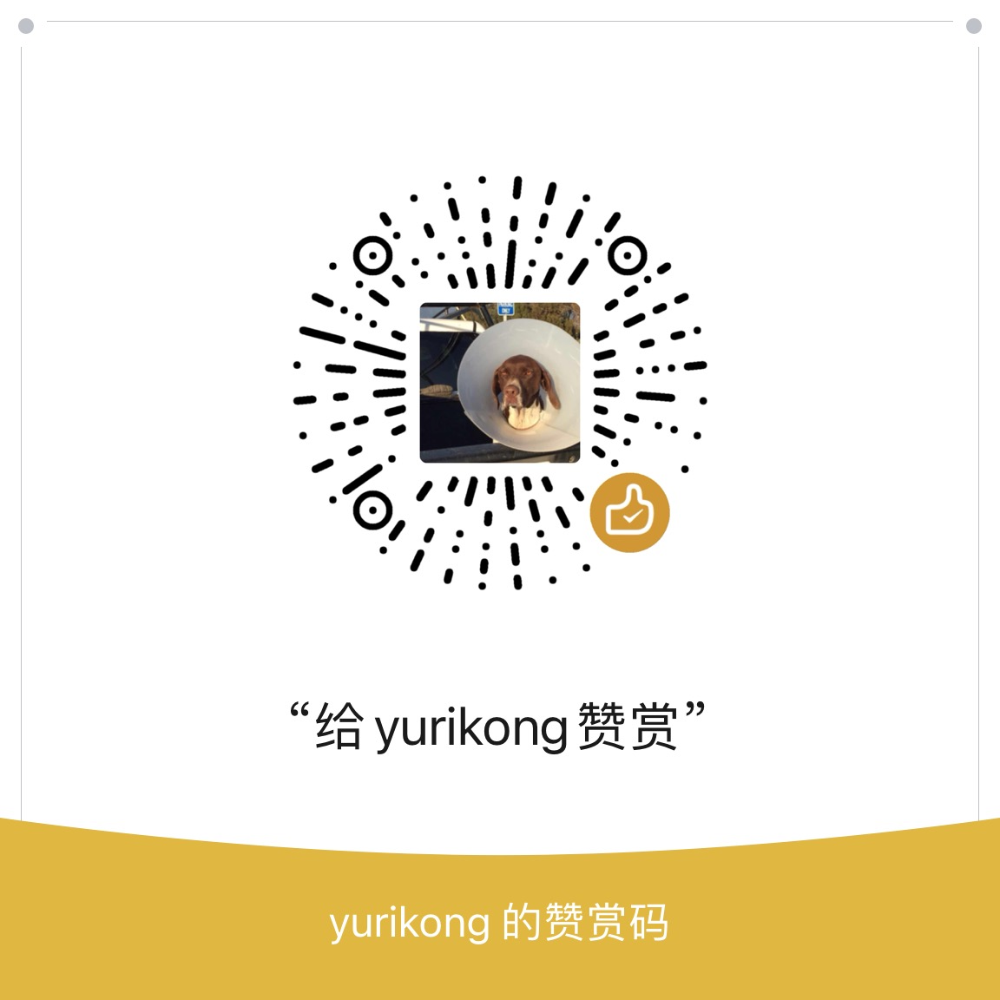

 

<h3 align="center">杜健强的主页</h3>

<a href="./README.md">英文</a>
| <a href="./README_zh.md">中文</a>

---

你好！欢迎来到我的主页！

## 📝 Table of Contents

- [关于](#关于)
- [作者](#作者)
- [鸣谢](#鸣谢)
- [打赏](#打赏)

## 🧐 关于 

欢迎来到我的主页！我的主页目前使用了 <a href="https://github.com/yurikong/astro-resume-minimalist/">Astro极简简历</a> 作为模板。这个模板也是我的作品。

## ✍️ 作者 

- [@杜健强](https://github.com/yurikong)

## 🎉 鸣谢 

- [@Brittany Chiang](https://brittanychiang.com)

## 💸 打赏 

- 微信

  

 

- 买杯咖啡

  
